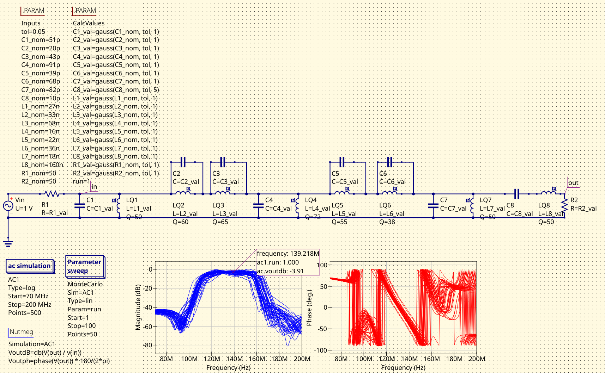
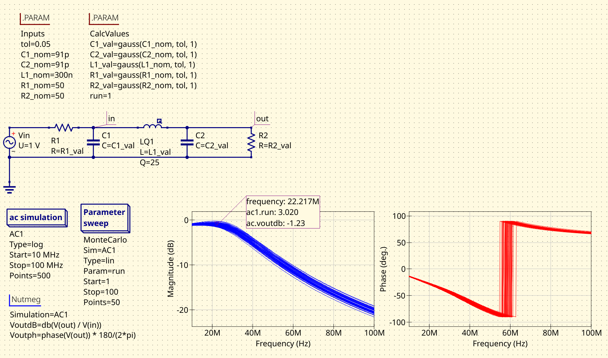
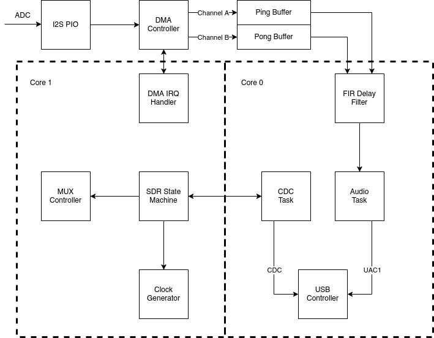

# SDR-Receiver 📻
**Hybrid Super Heterodyne Direct Conversion I/Q SDR Receiver**

An open-source, hybrid-architecture Software Defined Radio (SDR) receiver built around the RP2350 microcontroller. This project blends superheterodyne and direct-conversion (Tayloe detector) techniques. It's been designed to listen to the 2-meter band, but covers a tunable range of 5 MHz to 160 MHz. It features both USB-C (USB 1.1) and Ethernet data communication, as well as Power over Ethernet (PoE) capabilities. Ethernet streaming is currently functional but still under active development and not yet ready for final deployment.

## System Architecture


The receiver is divided into distinct HF and VHF signal paths. Each path utilizes a dedicated antenna equipped with an isolation transformer to prevent ground loops.

* HF Path: The isolated signal is routed directly to a multiplexer.
* VHF Path: The signal passes through a low-noise amplifier (LNA) followed by a band-pass filter. This filter prevents image frequencies from interfering with the desired intermediate frequency (IF). The signal is then mixed down by a double-balanced diode ring mixer and sent to the multiplexer.

A multiplexer selects between the HF signal and the down-converted VHF signal, feeding the active path into a shared low-pass filter.

After the low-pass filter, the signal makes its way to the Tayloe detector. The Tayloe detector mixes the signal down to be centered at 0 Hz with both an in-phase and a quadrature output. These I and Q outputs are then fed into the analog-to-digital converter. As this is a first revision board, as a backup and insurance measure, we've also connected the I and Q outputs to a 3.5 mm jack for use with an external sound card.

The whole SDR is built around the RP2350 microcontroller. The RP2350 will talk to SDR software either over a USB-C or Ethernet connection. It will receive commands to change the tuning frequency, and relay that information to the clock generator for this SDR, the Si5351-compatible MS5351M. It will also interface with a small I2C OLED display and a couple of buttons for a local user interface. It will receive the SDR I and Q data from the ADC via I2S, and send that data over either the USB-C or Ethernet connection to the computer running the SDR software.


## Hardware Specifications

* **Microcontroller:** Raspberry Pi RP2350A (with W25Q128JVS Flash)
* **Mixer Architecture:** Dual-Conversion Zero-IF (Double-Balanced Mixer first stage, Tayloe QSD second stage)
* **Clocking:** MS5351M (driven by a 24.576 MHz oscillator)
* **Network / Comms:** LAN8720A Ethernet PHY (10/100) using RP2350 Programmable IO
* **Power Supply:** USB-C (5 V), DC Barrel Jack Input, or Power over Ethernet (PoE via Ag9905LP module delivering a clean 5.65 V stepped down by LDOs)
* **Baseband Amplification:** OPA1612 op-amps for ultra-low noise I/Q amplification

---

## Filter Designs

### Charles (VHF band-pass filter, 110-160 MHz)


### Jaquavix (30 MHz low-pass filter)


---

## RP2350 GPIO Mapping
| GPIO Pin | Function | Subsystem |
| :--- | :--- | :--- |
| **0 - 1** | `I2C SDA / I2C SCL` | I2C |
| **2 - 3** | `Select button / Enter button` | UI Buttons |
| **4** | `Red LED` | LED |
| **5** | `Green LED` | LED |
| **6 - 7** | `ADC M0 / ADC M1` | ADC Mode |
| **8** | `VHF BP Filter Mux select` | Mux Selects |
| **9** | `Mux U18 Select` | Mux Selects |
| **10 - 12** | `Ethernet TX Enable, TXD0, TXD1` | Eth TX (Programmable IO) |
| **13 - 15** | `Ethernet Carrier Sense/Data Valid, RXD0, RXD1` | Eth RX (Programmable IO) |
| **16 - 18** | `LAN8720A Management Data I/O, CLK, Reset` | Eth Manage (Programmable IO) |
| **19 - 21** | `I2S CLK, Word Select, Data` | I2S (Programmable IO) |
| **22** | `Extra GPIO` | General |
| **23** | `Ethernet 50 MHz Clk output` | Programmable IO |
| **24 - 25** | `Extra GPIO` | General |
| **26** | `White LED` | LED |
| **27 - 28** | `Extra GPIO` | General |
| **29** | `Yellow LED` | LED |
| **56 - 60** | `QSPI` (SCLK, SDO, SD1-3, SS) | Flash Memory |

*(Note: Pin mapping is subject to change as the board layout is finalized. Refer to `pico.kicad_sch` for the raw schematic).*

---

## Software Design



The firmware runs on both cores of the RP2350 simultaneously, dividing responsibilities between real-time data acquisition/DSP (Core 0) and hardware control (Core 1).

### Data Path (ADC → USB)

I/Q samples from the ADC are clocked in over I2S using a PIO state machine. A DMA controller with two channels shuttles those samples into a **ping-pong buffer pair** — while one buffer is being filled (e.g., Ping), the other (Pong) is available for processing. When a transfer completes, a **DMA IRQ handler** on Core 1 signals Core 0 to begin processing the newly filled buffer, then arms the next DMA transfer into the opposite buffer.

On Core 0, the freshly filled buffer is passed through a **FIR delay filter** before being handed to the **Audio Task**. The FIR filter compensates for the ADC clone's fixed channel skew (about 1.9 microseconds between left and right channels), aligning I/Q timing before streaming. The Audio Task packages the filtered I/Q samples and feeds them to the **USB Controller** as a UAC1 (USB Audio Class 1) stream, making the SDR appear as a standard USB audio device to any SDR application running on the host.

### Control Path (USB CDC → Hardware)

A separate **CDC Task** on Core 0 monitors the USB CDC (virtual serial port) interface for incoming commands from the host. Commands are forwarded to the **SDR State Machine** on Core 1, which acts as the central coordinator for hardware control. In response, the state machine drives:

* **Clock Generator** — updates the si5351 over I2C to retune the LO frequency.
* **MUX Controller** — switches the hardware multiplexer to select the active signal path (HF or VHF).

Ethernet software is currently available in development form and can work, but it remains unreliable and is not considered deployment-ready.

The bidirectional arrow between the CDC Task and the SDR State Machine also allows the state machine to send status back to the host over the CDC interface.

### Summary

| Core | Responsibilities |
| :--- | :--- |
| **Core 0** | FIR filtering, Audio Task (UAC1 streaming), CDC Task (command parsing) |
| **Core 1** | DMA IRQ handling, SDR State Machine, Clock Generator (I2C), MUX control |

---

## Building the Firmware

The firmware uses CMake with the Raspberry Pi Pico SDK.

### Prerequisites

* CMake 3.13+
* ARM GCC toolchain (`arm-none-eabi-gcc`)
* Pico SDK checked out locally

Set the Pico SDK path before configuring:

```bash
export PICO_SDK_PATH=/path/to/pico-sdk
```

### Build Steps

```bash
cd firmware
mkdir -p build
cd build
cmake ..
cmake --build . -j
```

The firmware image is generated as `sdr.uf2` in the build output directory.

### Flashing

1. Hold BOOTSEL while plugging in USB-C to enter UF2 boot mode.
2. The board mounts as a USB mass-storage device.
3. Copy `sdr.uf2` onto that device.

---

## Issues for v0.1

The first order of boards arrived and we worked through our [board bring-up plan](board-bring-up.md) to safely get our board working, finding any errors we may have made. The following issues were discovered.
- A switching op-amp was used for the 2.25 V power bus and there was significant ringing on this power rail. Simple fix is to place a 50-ohm resistor on the output of the op-amp.
- Tayloe detector op-amp was miswired. The inverting and non-inverting inputs are swapped on the I inverting amplifier circuit.
- The Ethernet LAN chip is trying to generate a 50 MHz clock instead of receiving one. The Ethernet LED2 pin needs to be polarity flipped.
